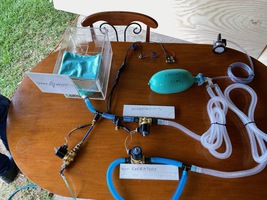

# The Spark Vent

The Spark Vent is an open-source ventilator design from a group of friends mostly from [Sparkhaus Studio](https://sparkhaus.studio) Makerspace in Newcastle, NSW, Australia. Our team is a mix of doctors, engineers, mechanics, and designers all working with one intent – to help.

[Contact](mailto:info@sparkvent.org)

      

### The 11th Person

Imagine your local hospital has 10 ventilators, but because of the COVID-19 pandemic, all those ventilators have been taken. Each patient on a ventilator usually spends one to two weeks on the ventilator, so, as you can see, your hospital can run out of ventilators pretty quickly in the middle of a pandemic.

What happens if you need one of those life-saving ventilators?

What if ***you*** are the 11th person?

That is why we are designing this ventilator.

### Aims

* **Works** - as close to these [UK Rapidly Manufactured Ventilator System Specifications](https://assets.publishing.service.gov.uk/government/uploads/system/uploads/attachment_data/file/876167/RMVS001_v3.1.pdf) as we can get it
* **Simple** - as we can get it
* **Safe** - as we can get it
* **Reliable** - as we can get it = ideally do 250,000 cycles without failure
* **Easy to make** - as we can get it
* **Made from existing medical equipment and easily-sourced industrial equipment** - where possible

### Immediate Goal
Provide a ventilator of last-resort for hospitals that have been overwhelmed by the sheer number of COVID-19 patients that require life-saving ventilation.

### Long term Goal
Develop a ventilator that could be used in developing countries to help save lives.

## 2x Ventilator Prototypes:

Based loosely on the very elegant [Manley Ventilator](https://onlinelibrary.wiley.com/doi/pdf/10.1111/j.1365-2044.1995.tb04517.x), our design is powered principally by gas pressure (from standard hospital wall oxygen and air flow meters) and gravity. The design intends to be make as frugal use of the potentially limited oxygen supply as possible, and to use standard anaesthetic equipment and easily sourced materials wherever possible.

In the first prototype we use a standard anaesthetic bag (essentially a thick-walled balloon) for our bellows. In the second we use a piston beloows made from two cylinders and a glove to act as the seal.

Three simple valves control the flow of gases. These can be industrial solenoid valves designed for frequent cycling, or a simple 3D printed cam that depresses a lever to seal off silicone tubes. The minimum (PEEP) and maximum (inspiratory pressure) is set but adjusting the height of tubes in a column of water. The control system can be a simple industrial 24V relay with a PLC, or for the second prototype, a simple electric motor with a power requirement less than 1W.

Prevention of potential health care infection is obviously paramount so we have sought to isolate the operator from aersolization by sealing and scavenging exhaled gases from valves where possible. A negative pressure valve has been added to prevent negative pressure pulmonary oedema.

## 1) Hinge Bellows, Anaesthetic Bag, 24DCV Industrial Solenoid Valves

## 2) Piston Bellows, 3D Printed Valves with Cam

## Images
### 1) Hinge Bellows, Anaesthetic Bag, 24DCV Industrial Solenoid Valves Images
 Basic design overview.
 Upgraded the valves to industrial grade.

### 2) Piston Bellows, 3D Printed Valves with Cam

 Rolling sock piston bellows
 Cam valve, lever squishes silicone tubing

## Team

* Dr Hamish Meares, Anaesthetic Doctor/Engineer
* Benjamin Brice, Industrial Designer
* Graham Brice, Biomedical Engineer
* Pete Micallef, CNC Tech & Design, Regal Machinery Services
* Jamie Oorschot, Mechanical Engineer
* Jeremy Funke, Electrical Engineer
* Lena Hackworth, Robotics Engineer
* Ray Aunei Mose, Biomedical Engineer
* Peter Humble, IT / Web designer
* With some much appreciated mechanical design help from the University of Newcastle’s Discipline of Mechanical Engineering

## Disclaimer

IN NO EVENT SHALL THE SPARKVENT TEAM, BE LIABLE TO ANY PARTY FOR DIRECT, INDIRECT, SPECIAL, INCIDENTAL, OR CONSEQUENTIAL DAMAGES, INCLUDING LOST PROFITS, ARISING OUT OF THE USE OF THESE SPECIFICATIONS, LIST OF MATERIALS, ELECTRONIC DESIGNS , SOFTWARE CODE AND ANY DOCUMENTATION, EVEN IF THE SPARKVENT TEAM HAS BEEN ADVISED OF THE POSSIBILITY OF SUCH DAMAGE. THE SPARKVENT TEAM DISCLAIMS ANY WARRANTIES, INCLUDING, BUT NOT LIMITED TO, THE IMPLIED WARRANTIES OF MERCHANTABILITY AND FITNESS FOR A PARTICULAR PURPOSE. THE SOFTWARE AND ACCOMPANYING DOCUMENTATION, SPECIFICATIONS, LIST OF MATERIALS, ELECTRONIC DESIGNS, SOFTWARE CODE AND ANY DOCUMENTATION IF PROVIDED HEREUNDER IS PROVIDED "AS IS". THE SPARKVENT HAS NO CLAIM THAT IT IS COMPLETED OR FUNCTIONAL AND HAS NO OBLIGATION TO PROVIDE MAINTENANCE, SUPPORT, UPDATES, ENHANCEMENTS, OR MODIFICATIONS. RISKS INCLUDE BUT ARE NOT LIMITED TO SERIOUS PHYSICAL INJURY, BURNS, DISABILITY AND/OR DEATH TO BOTH THE PATIENT AND THE OPERATOR.

## Copyright

 SparkVent by <a xmlns:cc="http://creativecommons.org/ns#" href="Sparkvent.org" property="cc:attributionName" rel="cc:attributionURL">SparkVent</a> is licensed under a <a rel="license" href="http://creativecommons.org/licenses/by-nc-sa/4.0/">Creative Commons Attribution-NonCommercial-ShareAlike 4.0 International License</a>. Based on a work at <a xmlns:dct="http://purl.org/dc/terms/" href="Sparkvent.org" rel="dct:source">Sparkvent.org</a>. Permissions beyond the scope of this license may be available at <a xmlns:cc="http://creativecommons.org/ns#" href="Sparkvent.org" rel="cc:morePermissions">Sparkvent.org</a>.

