# The Spark Vent

[The Spark Vent](https://www.youtube.com/watch?v=2_yuuIKCDco&feature=youtu.be) is an open-source ventilator design from a group of friends mostly from [Sparkhaus Studio](https://sparkhaus.studio) Makerspace in Newcastle, NSW, Australia. Our team is a mix of doctors, engineers, mechanics, and designers all working with one intent – to help.

[Contact: info@sparkvent.org](mailto:info@sparkvent.org)

   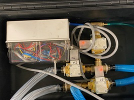 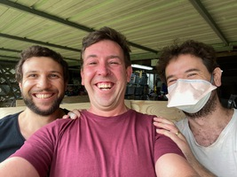  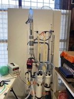

### The 11th Person

Imagine your local hospital has 10 ventilators, but because of the COVID-19 pandemic, all those ventilators have been taken. Each patient on a ventilator usually spends one to two weeks on the ventilator, so, as you can see, your hospital can run out of ventilators pretty quickly in the middle of a pandemic.

What happens if you need one of those life-saving ventilators?

What if ***you*** are the 11th person?

That is why we are designing this ventilator.

### Aims

* **Works** - as close to these [TGA (Australian Regulatory Body) Guidelines](https://www.tga.gov.au/sites/default/files/ventilator-covid-19-use-australia.pdf) or the more extensive [UK Rapidly Manufactured Ventilator System Specifications](https://assets.publishing.service.gov.uk/government/uploads/system/uploads/attachment_data/file/876167/RMVS001_v3.1.pdf) as we can get it
* **Simple** - as we can get it
* **Safe** - as we can get it
* **Reliable** - as we can get it = ideally do 250,000 cycles without failure
* **Easy to make** - as we can get it
* **Made from existing medical equipment and easily-sourced industrial equipment** - where possible

### Immediate Goal
Provide a ventilator of last-resort for hospitals that have been overwhelmed by the sheer number of COVID-19 patients that require life-saving ventilation.

### Long term Goal
Develop a ventilator that could be used in developing countries to help save lives.

## 2x Ventilator Prototypes, SparkVent1 & SparkVent2:

Based loosely on the very elegant [Manley Ventilator](https://onlinelibrary.wiley.com/doi/pdf/10.1111/j.1365-2044.1995.tb04517.x), our design is powered principally by gas pressure (from standard hospital wall oxygen and air flow meters) and gravity. The design intends to be make as frugal use of the potentially limited oxygen supply as possible, and to use standard anaesthetic equipment and easily sourced materials wherever possible.

In the first prototype we use a standard anaesthetic bag (essentially a thick-walled balloon) for our bellows. In the second we use a piston belows made from two cylinders and a glove to act as the seal.

Three simple valves control the flow of gases. These can be industrial solenoid valves designed for frequent cycling, or a simple 3D printed cam that depresses a lever to seal off silicone tubes. The minimum (PEEP) and maximum (inspiratory pressure) is set but adjusting the height of tubes in a column of water. The control system can be a simple industrial 24V relay with a PLC, or for the second prototype, a simple electric motor with a power requirement less than 1W.

Prevention of potential health care infection is obviously paramount so we have sought to isolate the operator from aerosolization by sealing and scavenging exhaled gases from valves where possible. A negative pressure valve has been added to prevent negative pressure pulmonary oedema.

### 1) SparkVent1: Hinge Bellows, Anaesthetic Bag, 24DCV Industrial Solenoid Valves
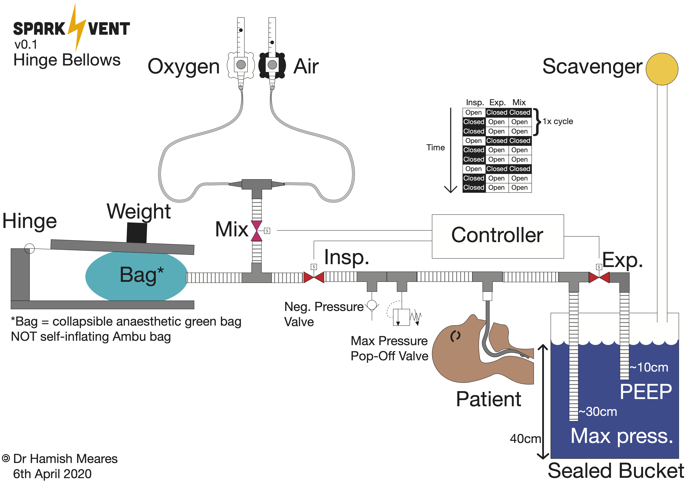
### 2) SparkVent2: Piston Bellows, 3D Printed Valves with Cam
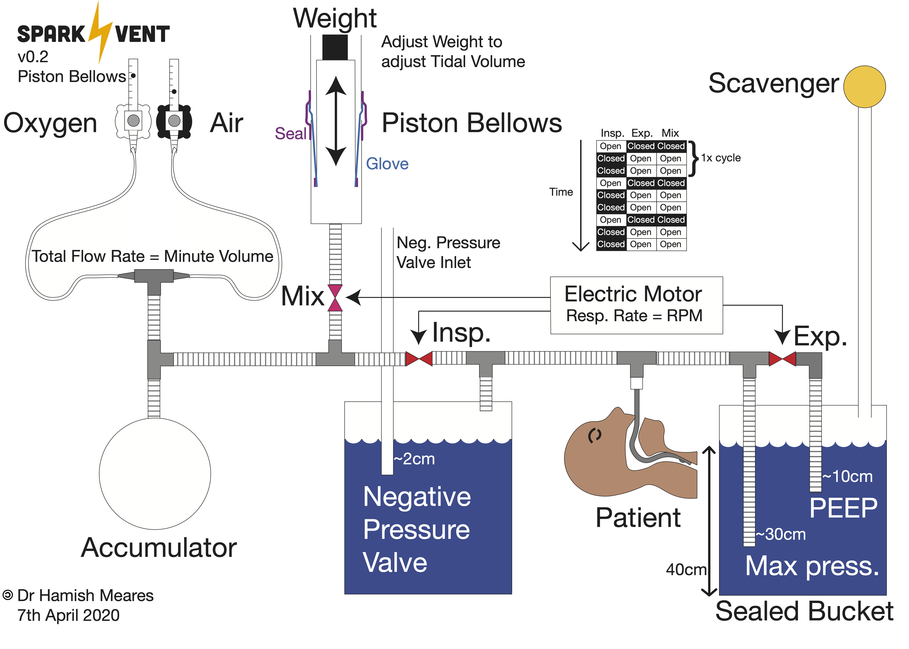

## Images
### 1) SparkVent1: Hinge Bellows, Anaesthetic Bag, 24DCV Industrial Solenoid Valves Images
 Basic design overview.
 Upgraded the valves to industrial grade.
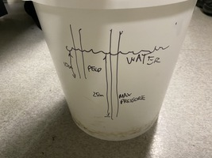
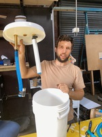
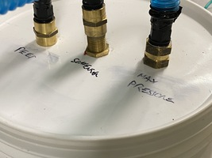

### 2) SparkVent2: Piston Bellows, 3D Printed Valves with Cam

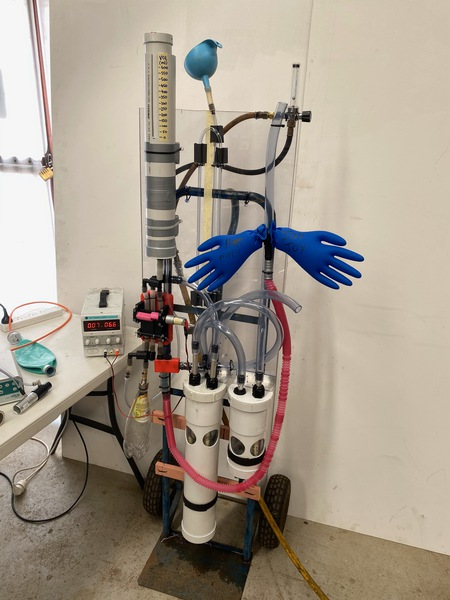 Rolling sock piston bellows
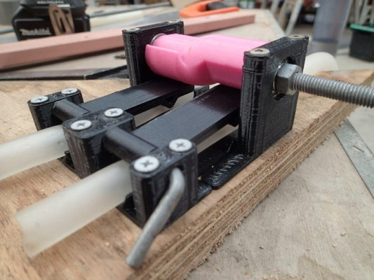 Cam valve, lever squishes silicone tubing
[SparkVent2 YouTube walk through](https://www.youtube.com/watch?v=2wGbHndPFvM) with help from the lovely peeps at Softy's.

## Schematics
1. [Hinge Bellows schematic pdf](Schematics/PDF/Ventilator_Schematic.pdf)
2. [Hinge Bellows dwg](Schematics/DWG/Ventilator_V3_Schematic.dwg)

## 3D Printed Parts for the Cam Valves

Greetings! I'm Jamie, a mechanical engineer working with a team of engineers and doctors on a simple Covid-19 Ventilator, based in Newcastle, Australia.

The intent of this ventilator is to get it as simple as possible without the need to purchase expensive items such as solenoid vavles and electronics.

The main component of the valves here is some silicone tube approximately 14mm OD and 2.6mm wall thickness. When pinched with some verniers I cannot blow through this tube for 4.2mm or less. I have used 3.5mm in the design so there is some room for component wear and deflection.

This thing is simple pinch tube air valve system run off a cam for an experimental Covid-19 ventilator (named Spark Vent 2).

The files for the 3D Printed parts can be found in the Directory [3D_Print_Files_for_Cam_Valves](3D_Print_Files_for_Cam_Valves) or from [Thingiverse](https://www.thingiverse.com/thing:4276756).

Tips:

1. Do not run a PLA Cam against the PLA followers. The friction is very high.
2. So far ABS for the Cam and PLA for the followers is fine but ABS for the follower also is likely to be fine (not yet tested). One reason we are shying away from using PLA for the followers is if it is left in a hot environment under load it could deform and not properly function.
3. When assembling the cam and bearings do not tighten it up too much. Over compression of the cam print will cause deformation of the print and the bearing will no longer be concentric and have a wobble. This bearing wobble will require a greater un-even torque to turn the shaft. I can turn M8 bolt thread with my fingers. I have supplied two stl files for the camshaft. One with a smaller bore so the M8 bolt can be rotated into the print. With some epoxy or appropriate glue on the thread will most certainly help. Try not to get glue in the bearings!
4. I have been printing solid just to be safe.
5. The followers are tapered in width. You need to lay it flat on one of its side faces when printing.
6. This mechanism is designed to be screwed to a solid structure. The picture shows it screwed to a piece of ply. Don't use ply on your ventilator! It cannot be cleaned. On the machine shown in the videos I used a piece of a 25mm thick kitchen cutting board made from HDPE.
7. A simple 5mm rod has been used for a pin for the followers. An M6 bolt may be used but you will need to drill out the prints. An M6 is not as good if you have to quickly pull out the followers while the machine is operating. To straighten 5mm rod i hold one end in the vice and turn the other with a drill.
8. In the design i have separated the bottom pinch point as a separate part. I have supplied 3 different prints, 3.5 being the standard. When you are happy the cam valves are working properly don't forget to glue you selected bottom pinch in place.
9. Lightly sanding the parts that pinch the silicon tube with wet and dry paper to make the smooth is also recommended. This will help the silicon tube last.

###  Materials 3D Cam Valve

* As shown in kit photo.
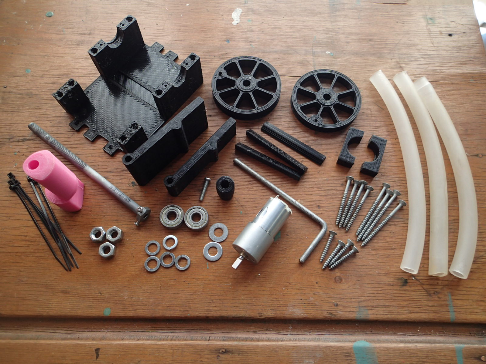
* I have included in the prints a pulley wheel just in case you cannot source a geared motor like the one I'm using (https://www.jaycar.com.au/36rpm-12vdc-reversible-gearhead-motor/p/YG2734). This geared motor has a 5mm shaft. I have drilled a hole in then end of the m8 bolt and tapped an m3 through the side of the hex head. The motor peaks at 0.15amps so it is greatly over rated for the task. Running continuous for 10-20 days straight is another matter!
* M8 bolt minimum 100mm long without the pulley. Minimum 125mm long with the pulley.
* Skateboard bearings used (608 - 8mm ID, 22mm OD, 7mm wide).

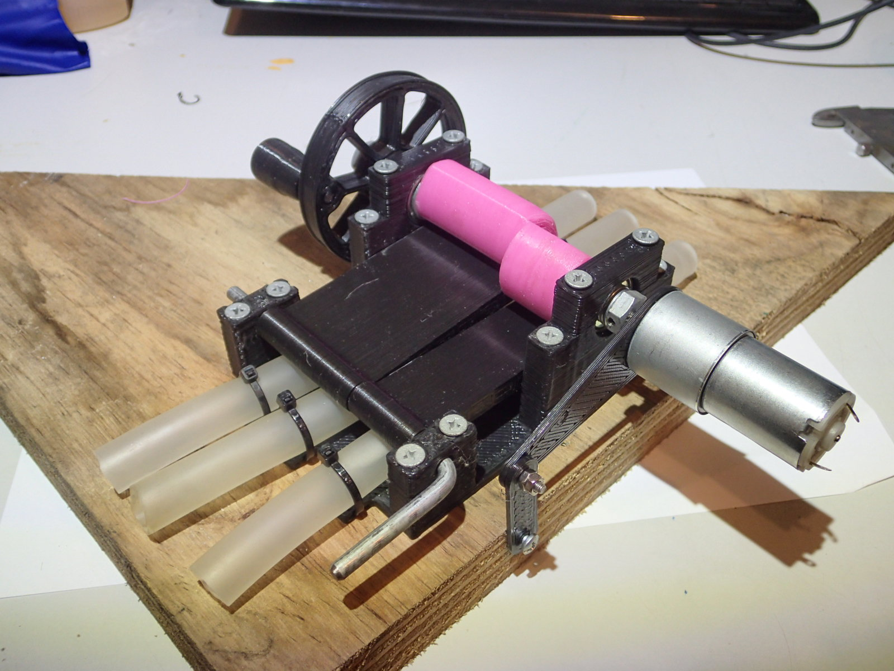
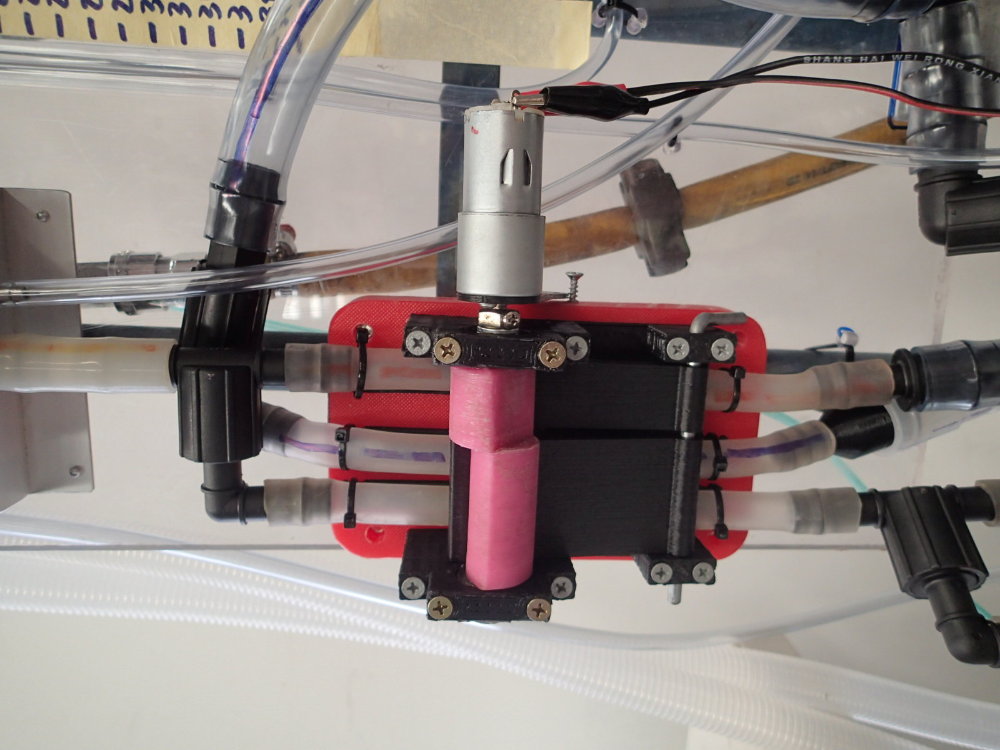
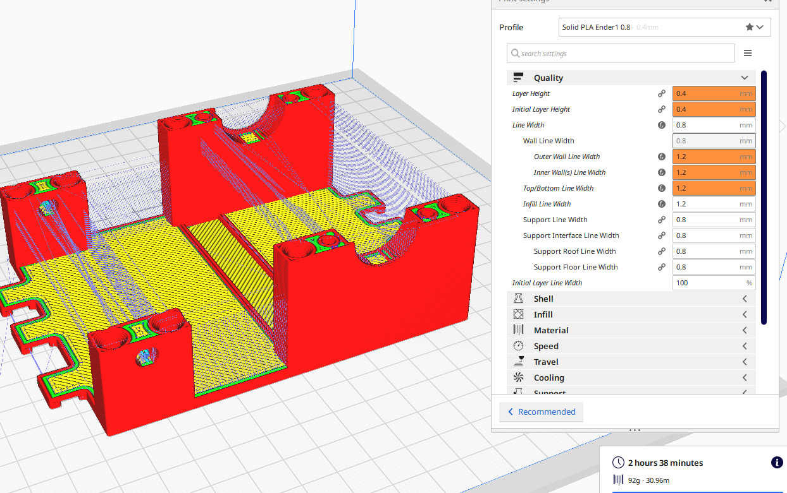
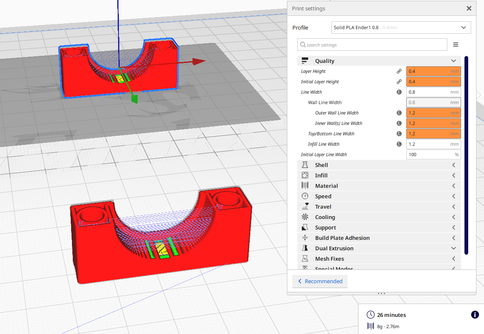
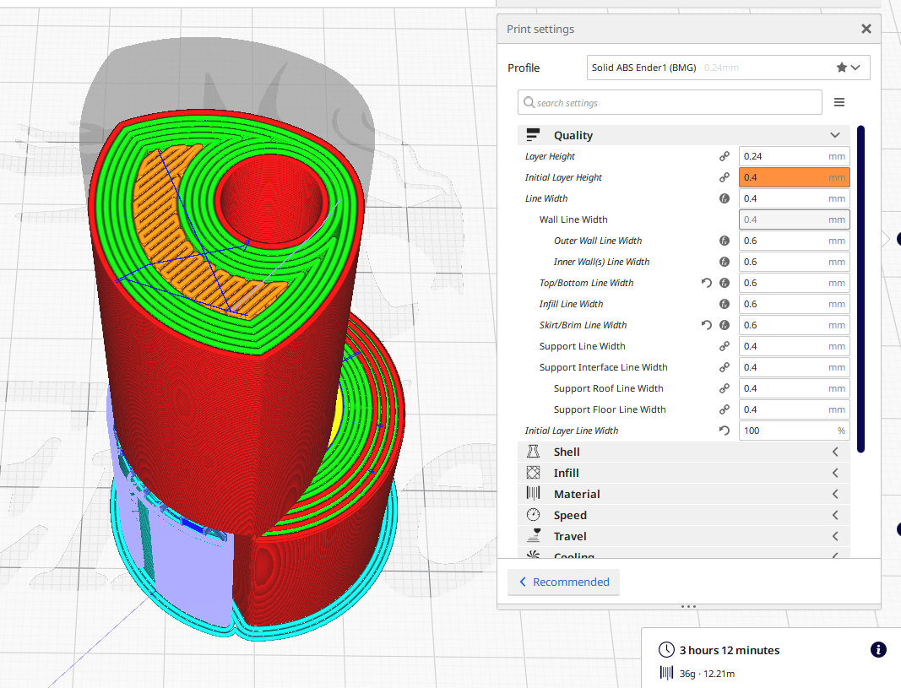

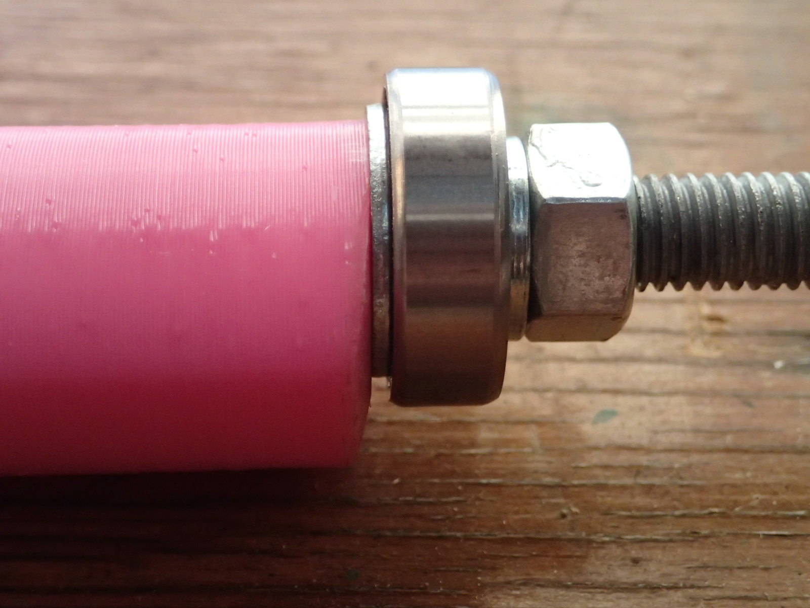
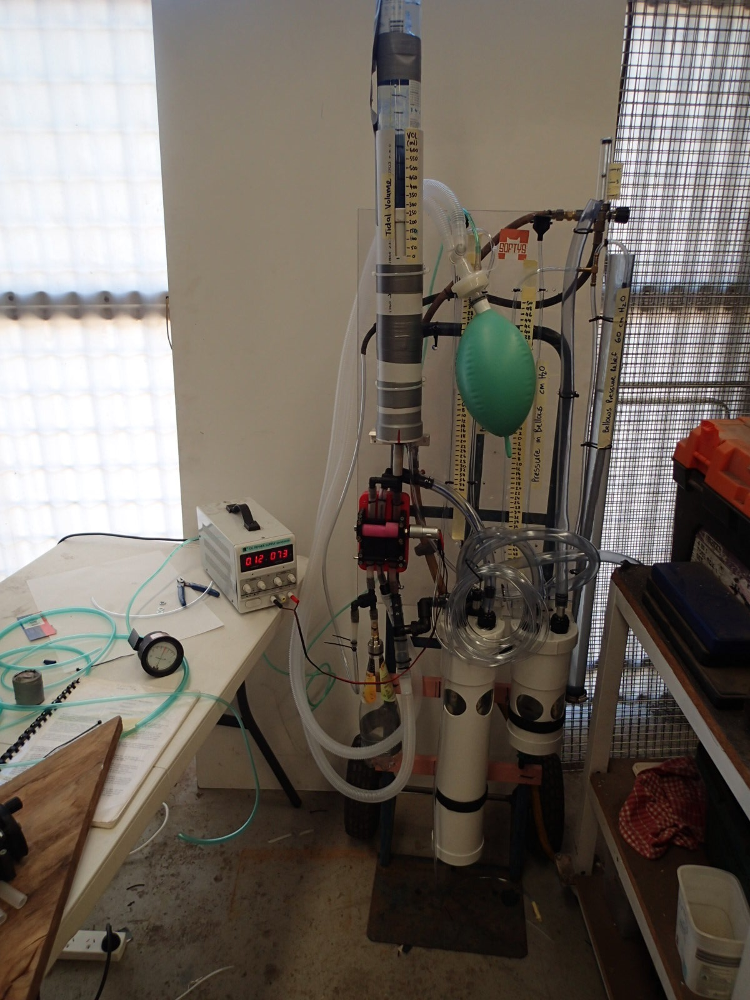

## Parts List
[Parts list](Parts_List/Ventilator_Parts.xlsx)

## Team

* Dr Hamish Meares, Anaesthetic Doctor/Engineer
* Benjamin Brice, Industrial Designer
* Graham Brice, Biomedical Engineer
* Pete Micallef, CNC Tech & Design, Regal Machinery Services
* Jamie Oorschot, Mechanical Engineer
* Jeremy Funke, Electrical Engineer
* Lena Hackworth, Robotics Engineer
* Ray Aunei Mose, Biomedical Engineer
* Peter Humble, IT / Web designer
* With some much appreciated mechanical design help from the University of Newcastle’s Discipline of Mechanical Engineering

* And the biggest thank you goes to all our support crews at home, going the extra mile so we can work on this project

## Disclaimer
THE SPARK VENT HAS NOT BEEN TESTED FOR SAFETY AND ITS SAFETY AND PERFORMANCE HAS NOT BEEN EVALUATED OR CONFIRMED. IT SHOULD ONLY BE CONSIDERED FOR USE AS AN ABSOLUTE LAST-RESORT OPTION IN A LIFE-THREATENING EMERGENCY SITUATION. THIS VIDEO IS PROVIDED FOR EDUCATIONAL AND INFORMATIVE PURPOSES DURING A GLOBAL HEALTH EMERGENCY FOR THE CORONA VIRUS PANDEMIC. WE HAVE SOUGHT TO FOLLOW THE UK AND AUSTRALIAN GUIDELINES (TGA) FOR AN EMERGENCY VENTILATOR DESIGN FOR THE PANDEMIC BUT HAVE DEVIATED SIGNIFICANTLY WITH OUR CHOICE IN MATERIALS AND THE ABSENCE OF ANY ALARMS.

IN NO EVENT SHALL THE SPARKVENT TEAM, BE LIABLE TO ANY PARTY FOR DIRECT, INDIRECT, SPECIAL, INCIDENTAL, OR CONSEQUENTIAL DAMAGES, INCLUDING LOST PROFITS, ARISING OUT OF THE USE OF THESE SPECIFICATIONS, LIST OF MATERIALS, ELECTRONIC DESIGNS , SOFTWARE CODE AND ANY DOCUMENTATION, EVEN IF THE SPARKVENT TEAM HAS BEEN ADVISED OF THE POSSIBILITY OF SUCH DAMAGE. THE SPARKVENT TEAM DISCLAIMS ANY WARRANTIES, INCLUDING, BUT NOT LIMITED TO, THE IMPLIED WARRANTIES OF MERCHANTABILITY AND FITNESS FOR A PARTICULAR PURPOSE. THE SOFTWARE AND ACCOMPANYING DOCUMENTATION, SPECIFICATIONS, LIST OF MATERIALS, ELECTRONIC DESIGNS, SOFTWARE CODE AND ANY DOCUMENTATION IF PROVIDED HEREUNDER IS PROVIDED "AS IS". THE SPARKVENT HAS NO CLAIM THAT IT IS COMPLETED OR FUNCTIONAL AND HAS NO OBLIGATION TO PROVIDE MAINTENANCE, SUPPORT, UPDATES, ENHANCEMENTS, OR MODIFICATIONS. RISKS INCLUDE BUT ARE NOT LIMITED TO SERIOUS PHYSICAL INJURY, BURNS, DISABILITY AND/OR DEATH TO BOTH THE PATIENT AND THE OPERATOR.

## Copyright

 SparkVent by <a xmlns:cc="http://creativecommons.org/ns#" href="Sparkvent.org" property="cc:attributionName" rel="cc:attributionURL">SparkVent</a> is licensed under a <a rel="license" href="http://creativecommons.org/licenses/by-nc-sa/4.0/">Creative Commons Attribution-NonCommercial-ShareAlike 4.0 International License</a>. Based on a work at <a xmlns:dct="http://purl.org/dc/terms/" href="Sparkvent.org" rel="dct:source">Sparkvent.org</a>. Permissions beyond the scope of this license may be available at <a xmlns:cc="http://creativecommons.org/ns#" href="Sparkvent.org" rel="cc:morePermissions">Sparkvent.org</a>.

