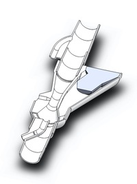
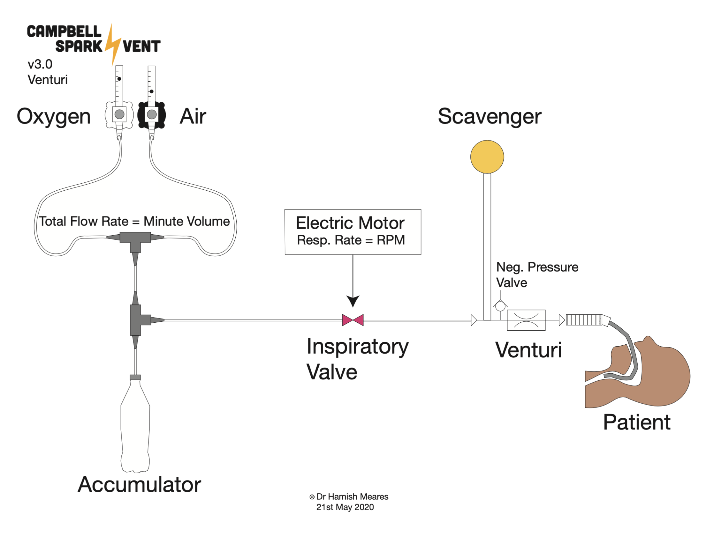

# The Campbell Spark Vent

The Campbell Spark Vent is an open-source Venturi-based ventilator design for emergency use during the COVID-19 pandemic.

Our aim is to make the simplest, safest ventilator we can for the lowest cost and the easiest to manufacture.

[Dr Duncan Campbell](http://www.anzca.edu.au/about-anzca/history-and-heritage/anaesthesia-stories/dr-duncan-campbell), the inventor of the [Campbell Ventilator](https://journals.sagepub.com/doi/pdf/10.1177/0310057X1204000601), created the initial Venturi circuit design as a means to provide a simple and safe ventilator design for the COVID-19 pandemic. The Venturi eliminates the need for bellows and hence, radically simplifies the design, construction and operation of the ventilator.

Our team has refined his original design to it's current version.

We provide this design to anyone who wishes to use it, make it or improve it to help save lives during the COVID-19 pandemic.

## Technical Details

The operator sets respiratory rate and also the minute volume and oxygen concentration using two flow meters for oxygen and air. The energy to drive the ventilator comes from the potential energy stored in the pressured gas. The only moving part in the ventilator is the inspiratory valve that operates via a solenoid that compresses a silicon tube that carries the fresh gas flow. The energy consumption of the solenoid valve is very low at around 6W and could be run from a battery if needed. The inspiratory and PEEP pressures are delivered via the venturi. Inspiratory pressure can be set by increasing the fresh gas flow rate, PEEP is set mechanically by turning a screw that sets the minimum pressure in the system. Pressure is monitored using a simple water manometer. The venturi mechanism provides a physical fail-safe as if the pressure in the fresh gas flow is increased to 400kPa (typical hospital gas pressure), the pressure delivered by the venturi is only around 5kPa, (50cmH2O) and the rest of the pressure is dissipated to the exhaust, as the narrow throat of the venturi naturally limits the pressure delivered.

The venturi must sit very close to the endotracheal tube to minimise dead space. The minimal dead space is necessary to minimise the time it takes for the system to reach it's target inspiratory pressure as ideally we would like a square wave pressure waveform.

This design is deliberately 'bare bones'. Ideally it should be used in conjunction with an oxygen saturation probe and an end-tidal carbon dioxide monitor to ensure the patient is adequately ventilated. We are in the process of adding a pressure and flow sensors so we can add alarm systems to this design.

### Aims

* **Works** - as close to these [TGA (Australian Regulatory Body) Guidelines](https://www.tga.gov.au/sites/default/files/ventilator-covid-19-use-australia.pdf) or the more extensive [UK Rapidly Manufactured Ventilator System Specifications](https://assets.publishing.service.gov.uk/government/uploads/system/uploads/attachment_data/file/876167/RMVS001_v3.1.pdf) as we can get it
* **Simple** - as we can get it
* **Safe** - as we can get it
* **Reliable** - as we can get it = ideally do 250,000 cycles without failure
* **Easy to make** - as we can get it
* **Made from existing medical equipment and easily-sourced industrial equipment** - where possible

### Immediate Goal
Provide a ventilator of last-resort for hospitals that have been overwhelmed by the sheer number of COVID-19 patients that require life-saving ventilation.

### Long term Goal
Develop a ventilator that could be used in developing countries to help save lives.

### Testing
We have performed bench testing of the pressure, flow and volume characteristics  on a test-lung in a hospital biomedical workshop (Graphs below). We are currently performing reliability testing of the solenoid 3D-printed valve. Next phase we will be adding alarms and usability testing.

## Team

* Dr Hamish Meares, Anaesthetic Doctor/Engineer
* Dr Duncan Campbell, Anaesthetic Doctor (retired) /Inventor of the Campbell Ventilator
* Benjamin Brice, Industrial Designer
* Graham Brice, Biomedical Engineer
* Pete Micallef, CNC Tech & Design, Regal Machinery Services
* Jamie Oorschot, Mechanical Engineer
* Jeremy Funke, Electrical Engineer
* Ray Aunei Mose, Biomedical Engineer
* Peter Humble, IT / Web designer
* With some much appreciated mechanical design help from the University of Newcastle’s Discipline of Mechanical Engineering

## Much Appreciated Support

* [Hall & Wilcox Lawyers](https://hallandwilcox.com.au)
* Dr Carl Hughes, Anaesthetic Doctor & GP
* Dr David Campbell, Anaesthetic Doctor
* Dr Keith Streatfield, Anaesthetic Doctor
* Dr Steve Pickering, Anaesthetic Doctor

## Disclaimer
THE SPARK VENT HAS NOT BEEN TESTED FOR SAFETY AND ITS SAFETY AND PERFORMANCE HAS NOT BEEN EVALUATED OR CONFIRMED. IT SHOULD ONLY BE CONSIDERED FOR USE AS AN ABSOLUTE LAST-RESORT OPTION IN A LIFE-THREATENING EMERGENCY SITUATION. THIS VIDEO IS PROVIDED FOR EDUCATIONAL AND INFORMATIVE PURPOSES DURING A GLOBAL HEALTH EMERGENCY FOR THE CORONA VIRUS PANDEMIC. WE HAVE SOUGHT TO FOLLOW THE UK AND AUSTRALIAN GUIDELINES (TGA) FOR AN EMERGENCY VENTILATOR DESIGN FOR THE PANDEMIC BUT HAVE DEVIATED SIGNIFICANTLY WITH OUR CHOICE IN MATERIALS AND THE ABSENCE OF ANY ALARMS.

IN NO EVENT SHALL THE SPARKVENT TEAM, BE LIABLE TO ANY PARTY FOR DIRECT, INDIRECT, SPECIAL, INCIDENTAL, OR CONSEQUENTIAL DAMAGES, INCLUDING LOST PROFITS, ARISING OUT OF THE USE OF THESE SPECIFICATIONS, LIST OF MATERIALS, ELECTRONIC DESIGNS , SOFTWARE CODE AND ANY DOCUMENTATION, EVEN IF THE SPARKVENT TEAM HAS BEEN ADVISED OF THE POSSIBILITY OF SUCH DAMAGE. THE SPARKVENT TEAM DISCLAIMS ANY WARRANTIES, INCLUDING, BUT NOT LIMITED TO, THE IMPLIED WARRANTIES OF MERCHANTABILITY AND FITNESS FOR A PARTICULAR PURPOSE. THE SOFTWARE AND ACCOMPANYING DOCUMENTATION, SPECIFICATIONS, LIST OF MATERIALS, ELECTRONIC DESIGNS, SOFTWARE CODE AND ANY DOCUMENTATION IF PROVIDED HEREUNDER IS PROVIDED "AS IS". THE SPARKVENT HAS NO CLAIM THAT IT IS COMPLETED OR FUNCTIONAL AND HAS NO OBLIGATION TO PROVIDE MAINTENANCE, SUPPORT, UPDATES, ENHANCEMENTS, OR MODIFICATIONS. RISKS INCLUDE BUT ARE NOT LIMITED TO SERIOUS PHYSICAL INJURY, BURNS, DISABILITY AND/OR DEATH TO BOTH THE PATIENT AND THE OPERATOR.

## Copyright

 SparkVent by <a xmlns:cc="http://creativecommons.org/ns#" href="Sparkvent.org" property="cc:attributionName" rel="cc:attributionURL">SparkVent</a> is licensed under a <a rel="license" href="http://creativecommons.org/licenses/by-nc-sa/4.0/">Creative Commons Attribution-NonCommercial-ShareAlike 4.0 International License</a>. Based on a work at <a xmlns:dct="http://purl.org/dc/terms/" href="Sparkvent.org" rel="dct:source">Sparkvent.org</a>. Permissions beyond the scope of this license may be available at <a xmlns:cc="http://creativecommons.org/ns#" href="Sparkvent.org" rel="cc:morePermissions">Sparkvent.org</a>.

