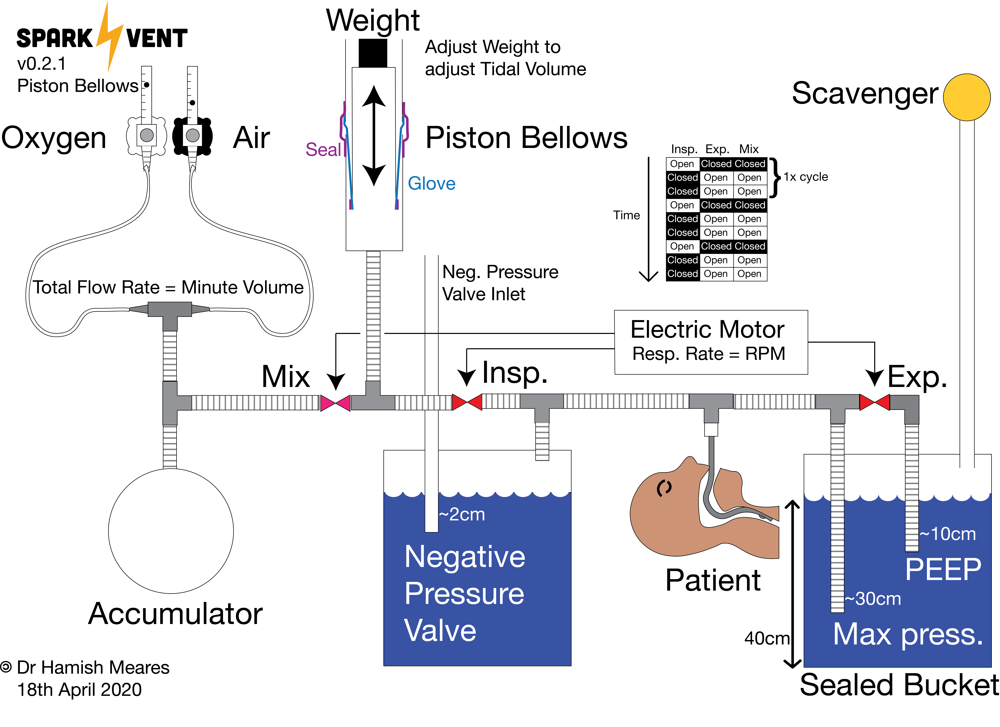

# The Spark Vent

The Spark Vent is an open-source ventilator design from a group of friends mostly from [Sparkhaus Studio](https://sparkhaus.studio) Makerspace in Newcastle, NSW, Australia. Our team is a mix of doctors, engineers, mechanics, and designers all working with one intent – to help.

      

### The 11th Person

Imagine your local hospital has 10 ventilators, but because of the COVID-19 pandemic, all those ventilators have been taken. Each patient on a ventilator usually spends one to two weeks on the ventilator, so, as you can see, your hospital can run out of ventilators pretty quickly in the middle of a pandemic.

What happens if you need one of those life-saving ventilators?

What if ***you*** are the 11th person?

That is why we are designing this ventilator.

### Aims

* **Works** - as close to these [UK Rapidly Manufactured Ventilator System Specifications](https://assets.publishing.service.gov.uk/government/uploads/system/uploads/attachment_data/file/876167/RMVS001_v3.1.pdf) as we can get it
* **Simple** - as we can get it
* **Safe** - as we can get it
* **Reliable** - as we can get it = ideally do 250,000 cycles without failure
* **Easy to make** - as we can get it
* **Made from existing medical equipment and easily-sourced industrial equipment** - where possible

### Immediate Goal
Provide a ventilator of last-possible-resort for hospitals that have been overwhelmed by the sheer number of COVID-19 patients that require life-saving ventilation.

### Long term Goal
Develop a ventilator that could be used in developing countries to help save lives.

## 2x Ventilator Prototypes

## 1) Hinge Bellows, Anaesthetic Bag, 24DCV Industrial Solenoid Valves

 Basic design overview.
 Upgraded the valves to industrial grade.

## 2) Piston Bellows, 3D Printed Valves with Cam

## Team

* Dr Hamish Meares, Anaesthetic Doctor/Engineer
* Benjamin Brice, Industrial Designer
* Graham Brice, Biomedical Engineer
* Pete Micallef, CNC Tech & Design, Regal Machinery Services
* Jamie Oorschot, Mechanical Engineer
* Jeremy Funke, Electrical Engineer
* Lena Hackworth, Robotics Engineer
* Ray Aunei Mose, Biomedical Engineer
* Peter Humble, IT / Web designer
* With some much appreciated mechanical design help from the University of Newcastle’s Discipline of Mechanical Engineering

